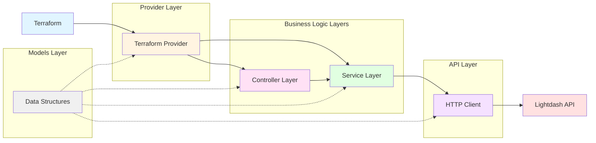

# Contributing to `terraform-provider-lightdash`

The `terraform-provider-lightdash` project is open source and we warmly welcome contributions from the community.
Whether you're fixing bugs, adding new features, or improving the documentation, your efforts will help enhance the Lightdash provider for everyone.

The provider is built using the Terraform Plugin SDK.
For those interested in contributing, we recommend reviewing the [Custom Framework Providers tutorial](https://developer.hashicorp.com/terraform/tutorials/providers-plugin-framework) provided by HashiCorp.
This resource offers an excellent overview of the SDK and serves as a solid foundation for understanding how to enhance this provider.

## Setting Up Your Local Development Environment

### Prerequisites

Before you begin, ensure you have the following prerequisites installed:

- Terraform: Use `tfenv install` to install the specific Terraform version required, as indicated in the `.terraform-version` file.
- GNU Make: Utilize the `make` command to facilitate building and testing the provider. Targets are defined in the [GNUmakefile](./GNUmakefile).
- [Trunk](https://docs.trunk.io/) (Optional): Trunk is a developer experience (DevEx) toolkit that enables you to ship code quickly while maintaining the necessary guardrails for excellent eng teams. If you use macOS, `brew install trunk-io` enables you to install Trunk.

The subsequent commands enable us to set up the local development environment.

```shell
make setup-dev
```

### Configuring the Provider for Local Development

To use the local version of the `terraform-provider-lightdash`, you must update your Terraform configuration. Add the local provider to your `~/.terraformrc` file to override the default provider source location.

```terraform
provider_installation {

  dev_overrides {
      "github.com/ubie-oss/terraform-provider-lightdash" = "local/path/to/provider"
  }

# For all other providers, install them directly from their origin provider

# registries as normal. If you omit this, Terraform will _only_ use

# the dev_overrides block, and so no other providers will be available

  direct {}
}
```

### Building the Provider

To compile the provider binary from source, run:

```shell
make build
```

## Understanding the Codebase

This section provides an overview of the codebase structure and architecture to help contributors understand how the provider is organized.

### Directory Structure Overview

The provider codebase is organized into two main directories under `internal/`:

- **`internal/provider/`**: Contains the Terraform provider implementation, including data sources, resources, functions, and provider configuration
- **`internal/lightdash/`**: Contains the Lightdash API client and business logic organized in a layered architecture

### Architecture Layers

The provider follows a layered architecture pattern where each layer has a specific responsibility:



### Data Flow

When a Terraform operation is executed, data flows through the layers as follows:

1. **Terraform** invokes the provider resource/data source method
2. **Provider Layer** validates input and calls controllers or services
3. **Controller Layer** (if needed) orchestrates multiple services for complex operations
4. **Service Layer** encapsulates business logic and calls API functions
5. **API Layer** makes HTTP requests to the Lightdash API
6. **Models Layer** provides data structures used throughout the flow

This layered architecture provides:

- **Separation of Concerns**: Each layer has a clear, single responsibility
- **Testability**: Layers can be tested independently
- **Maintainability**: Changes to API endpoints only affect the API layer
- **Reusability**: Services and controllers can be reused across multiple resources

## Testing

To ensure the quality and functionality of your changes, it's essential to test the provider before submitting a contribution.

### Unit Testing

Run the unit tests to verify your changes:

```shell
make test
```

### Acceptance Tests

#### Running the Acceptance Tests

To run the acceptance tests, follow these steps:

1. Obtain an API token from your Lightdash instance to authenticate requests.

2. Copy the `.env.template` file to `.env`:

   ```shell
   cp .env.template .env
   ```

3. Modify the `.env` file with your Lightdash instance credentials:
   - `LIGHTDASH_URL`: The URL of your Lightdash instance
   - `LIGHTDASH_API_KEY`: Your Lightdash API key
   - `LIGHTDASH_PROJECT`: The UUID of the Lightdash project to use for testing

4. Run the acceptance tests using the following command:

   ```shell
   make testacc
   ```

Note: Acceptance tests require a Lightdash instance and may take longer to complete.

#### Implementing Acceptance Tests

Please refer to the following documentation for basic information on how to implement the acceptance tests:

<https://developer.hashicorp.com/terraform/plugin/framework/acctests>

[internal/provider/acc_tests/](./internal/provider/acc_tests/) is the directory for the acceptance tests.
We load the terraform configurations for the acceptance tests.
We separate the acceptance tests into different files for each resource.
By doing so, we can separately manage the acceptance tests for each test case.

For instance, [internal/provider/resource_lightdash_space_test.go](./internal/provider/resource_lightdash_space_test.go) is the file for the acceptance tests for the `lightdash_space` resource.
We load the terraform configurations for the acceptance tests from the [internal/provider/acc_tests/resource_lightdash_space/](./internal/provider/acc_tests/resource_lightdash_space/) directory.

```shell
# `internal/provider/acc_tests/<resource>/<test_case>/<step_configuration>.tf`

internal/provider/acc_tests/resource_lightdash_space/
├── create_space
│   ├── 010_create_space.tf
│   └── 020_create_space.tf
├── nested_space
│   ├── 010_nested_space.tf
│   └── 020_nested_space.tf
└── space_access
    ├── 010_space_access.tf
    └── 020_space_access.tf
```

## Publishing the Provider to the Terraform Registry

### Account Setup for Terraform Registry

Before you can publish your provider, you must set up an account on the Terraform Registry. This is a prerequisite for the subsequent steps in the publishing process.

To publish the provider to the Terraform Registry, a series of steps must be followed using GitHub Actions. These steps were initially configured manually by the original author.
For instance, we need to:

- Register a PGP key to the Terraform Registry
- Register GtiHub Actions' secrets

The official tutorials describes the steps in detail.

- [Release and Publish a Provider to the Terraform Registry](https://developer.hashicorp.com/terraform/tutorials/providers/provider-release-publish)

### Publish a New Release

All we have to do is to create a new release on GitHub.
The GitHub Actions will automatically publish the provider to the Terraform Registry.
