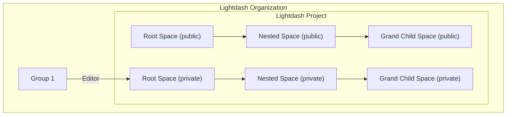
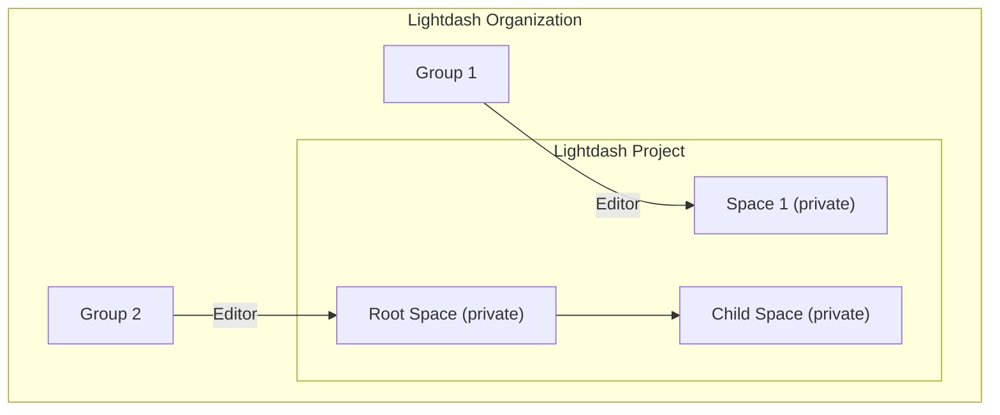
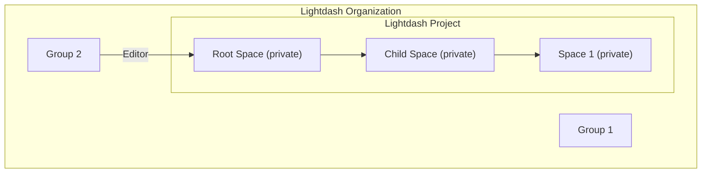

# Space Access

## Space Access Details

Spaces in Lightdash serve as organizational containers, akin to folders, for saving and managing charts and dashboards. Every saved chart and dashboard resides within a single Space at any given time.

Access to Spaces is managed at the Space level and interacts with both Project and Organization level permissions. There are two main types of Space access:

### Restricted Access Spaces

By default, newly created Spaces are Restricted. In a Restricted Access Space, only Organization Admins and users explicitly invited to the Space have access to its content.

- **Access Requirement:** Invitation to the Space or being an Organization Admin.
- **Visibility:** Only visible to invited members and Admins.
- **Permission Inheritance:** Does not automatically inherit permissions from parent Spaces if nested.

### Public Spaces

Public Spaces are accessible to everyone who has access to the Project containing the Space.

- **Access Requirement:** Access to the containing Project.
- **Visibility:** Visible to anyone with Project access.
- **Permission Inheritance:** Inherits permissions from the containing Project by default.

### Space Roles

Within a Space, there are three distinct roles that define a user's capabilities:

- **Can View:** Users with this role can see that the Space exists and view the charts and dashboards within it.
- **Can Edit:** Users with this role can edit the content within the Space, including adding, deleting, and renaming charts and dashboards.
- **Full Access:** Users with this role have complete control over the Space. They can view, edit, manage content, manage access permissions for other users, and edit the Space's details (name, description, etc.).

### Interaction with Project and Organization Permissions

Space permissions overlay and can modify the permissions inherited from a user's Project and Organization roles.

- A user requires at least `Can View` access to a Space to see it and its contents.
- Space permissions primarily control who can edit the _content within that specific Space_ and manage the _Space itself_. They do not grant broader Project or Organization level permissions. For example, a Project Viewer given `Can Edit` Space permissions can only edit content in that Space, not create/edit content elsewhere in the project where they lack the necessary Project role permission. Conversely, a Project Editor given `Can View` Space permissions can still edit content in other parts of the project but not in that specific Space.
- In Public Spaces, a user's Space permission defaults to the highest level allowed by their Project role (`Editor` becomes `Can Edit`, `Viewer` becomes `Can View`). Users with `Full Access` to a Public Space can increase or restrict other users' inherited permissions within that Space (except for Admins).
- In Restricted Spaces, only users with `Full Access` can invite others to the Space. Users cannot be removed from Public Spaces; access must be restricted by changing the Space type to Restricted.

### Adjusting Space Permissions

Permissions can be adjusted for individual users or groups within a Space.

- If a user belongs to multiple groups with access to a Space, they inherit the highest level of access granted among those groups.
- Individual user permissions for a Space can override permissions inherited from their groups.

For more details on Project and Organization roles and their general permissions, refer to the Lightdash documentation on Roles and Permissions.

**Sources:**

- [Lightdash Documentation: Spaces](https://docs.lightdash.com/references/spaces)
- [Lightdash Documentation: Roles and permissions](https://docs.lightdash.com/references/roles)

## Space Access with Nested Spaces

The main ideas of space access with nested spaces are:

1. Nested spaces inherit the visibility of the root space, and
2. Nested spaces inherit permissions from the root space.

So, we can't control the visibility and space access of nested spaces.
Only we can control is them of the root space.

Moreover, if we move a space no matter which it is a root or nested space to under another space, the visibility and space access of the moved space will be the same as the root space.

### Case 1: Root space and its nested space

If a root space is a public space, the nested space will be a public space.
We can't control the visibility and space access of the nested space under a public root space.

If a root space is a private space, the nested space will be a private space as the same as the root space.
We can't control the visibility and space access of the nested space under a private root space.
So, if Group 1 has the editor role in the root space, members of Group 1 can edit the nested space as well.

### Case 2: Moving a space to under another space

We have learned that the visibility and space access of the moved space will be the same as the root space.
So, let's move on to the case where we move a space to under another space.

Here, we have two groups, Group 1 and Group 2.
Group 1 has the editor role in Space 1.
Group 2 has the editor in the Root Space.
Then, we move Space 1 to under the Root Space.

If we move Space 1 to under the Root Space, the visibility and space access of Space 1 will be the same as the Root Space.
Group 1 will no longer have the editor role in Space 1.

#### Before Moving

#### After Moving

